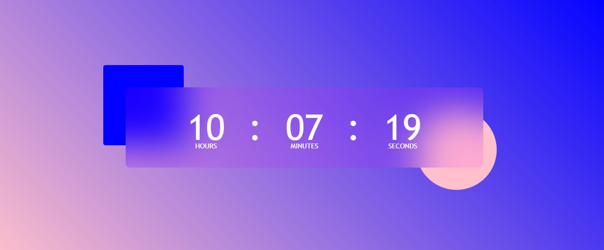

# Digitalclock
 
 ## Features

 * Updates Hours,Minutes and Seconds continuesly. 

 ### HTML

* Created a block with background and created Hours, Minutes and Seconds.

* At the corners created a square and circle to look better.

### CSS :

* Applied background with linear gradient.

* Applied style properties for the corners square and circle.

* Made background blur block of Hours,Minutes and Seconds.

### Javascript 

### Linking the Hours, Minutes and Seconds to javascript

* To link the block of Digital clock applied id's.

### Updating the Time with Javascript

* Created an object with current Date, It shows the Date, Day,Month and Time.

* By using object to update hours took getHours method and for minutes and seconds took getMinutes method and getSeconds method.

### Condition to add zero before the single digit

* Applied condition for the Hours, Minutes and Seconds when they are less than 10 add Zero before if it has two digits leave the space before with empty.

